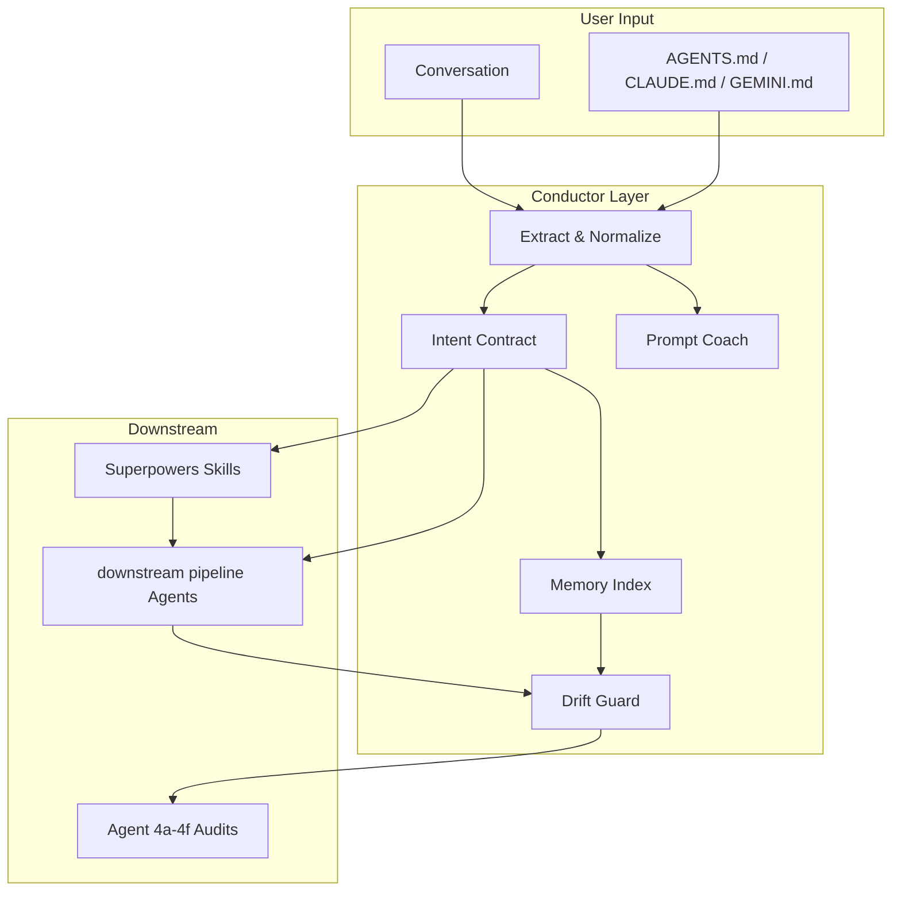

# Brainstorming Session Overview

**Project:** Conductor  
**Date:** 2026-06-17  
**Facilitator:** design session  
**Method:** Superpowers brainstorming skill

---

## Problem statement (one sentence)

AI coding assistants produce unreliable output not because models are weak, but because **user intent is never frozen, constraints are scattered, and drift is detected too late** (usually at code review or production).

---

## Evidence from existing work

| Incident / asset | Lesson |
|------------------|--------|
| **sample desktop app audit** | Code compiled, review passed, production had stubbed features |
| **Drift-resistant template** | 80% of agent failures are constraint/skipping/assumption issues — preventable |
| **alignment review idea-alignment** | Spec vs implementation drift is recurring; needs better upstream contract |
| **session governance Conductor (today)** | Go/no-go for products only — does not govern in-session intent |
| **Superpowers** | Process discipline exists; no intent contract or user prompt coaching |

---

## Success criteria

### Must have (v1)

- [ ] Intent Contract schema with validation
- [ ] Drift score vs contract (scope, constraints, spec alignment)
- [ ] User coaching messages for vague / explosive prompts
- [ ] Reads `AGENTS.md`, `CLAUDE.md`, `GEMINI.md` when present
- [ ] Superpowers skill install path
- [ ] Integration doc for downstream pipeline

### Should have (v1.x)

- [ ] CLI: `conductor contract`, `conductor drift`, `conductor coach`
- [ ] Session memory across days (RAG-lite index)
- [ ] Pivot log with stakeholder acknowledgment
- [ ] Hooks for alignment review aggregator

### Nice to have (v2)

- [ ] IDE extension / Cursor hook
- [ ] Multi-model normalization (same contract, any model)
- [ ] Gold-standard test ingestion from incidents
- [ ] Team dashboard (drift trends)

---

## Stakeholders

| Stakeholder | Interest |
|-------------|----------|
| **Solo maintainer** | product pipeline, downstream app launches, less rework |
| **Vault & Compass** | Brand credibility via OSS tooling under vaultcompasshq |
| **External devs** | Installable skill, no downstream pipeline required |
| **Superpowers community** | Upstream skill contribution |
| **downstream pipeline** | Upstream governance for session governance–#8 |

---

## Constraints

- Must work **on top of** existing models (no custom model)
- Must not duplicate Superpowers brainstorming — **extend** it
- Must not replace downstream pipeline agents — **feed** them
- Public repo — no product IP or secrets
- Prefer file-based, local-first (no mandatory cloud)

---

## Out of scope (v1)

- Custom fine-tuned models
- Full IDE fork
- Autonomous multi-hour coding runs
- Replacing CodeRabbit / Bugbot for security review
- Product ideation scoring (stays in downstream product pipeline)

---

## Session outputs

1. Competitive analysis → `02-competitive-analysis.md`
2. Three approaches evaluated → `03-approaches-and-recommendation.md`
3. Full design spec → `../superpowers/specs/2026-06-17-conductor-design.md`
4. Intent Contract schema → `../schemas/intent-contract.schema.json`
5. 14-week roadmap → `../phases/implementation-roadmap.md`
6. Open questions → `04-open-questions.md`

---

## Architecture sketch

---

## Review checklist (brainstorming skill)

- [x] Explore project context
- [x] Visual companion — not needed (architecture is text/diagram)
- [x] Clarifying questions — captured in `04-open-questions.md`
- [x] 2–3 approaches proposed
- [x] Design presented in spec
- [x] Design doc written
- [ ] Spec self-review — in progress
- [ ] **User reviews spec** — **BLOCKING**
- [ ] Invoke writing-plans — after approval
